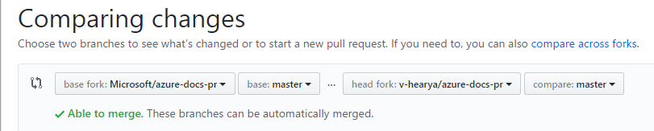

# Azure TOC to landing page updates

> [!NOTE]
> *3-17-2017* -- There are discussions on the content team to move all landing page updates to this model.

For Azure services (anything under docs.ms.com/azure/) there is a landing page in almost all cases, and a TOC. These two don't have to have the same links *except* in the Reference section. The Reference sections of these two should have the same links and be as aligned as possible.

> [!NOTE]
> This doesn't mean that the links need to be in the same order or have the same headings. The landing pages have certain sections in the template that the TOCs don't have to align with. 

## The process
When writers update the TOCs and submit the pull requests, the vendors in charge of Azure maintenance monitor them for changes to the reference sections. When they see them, they will create a new bug and assign it to Jason Groce. They will also sometimes mention @JasonGroce in the pull request.

### VSO information
Azure landing page issues are filed in the [TechnicalContent](https://mseng.visualstudio.com/VSChina/_workitems) project.

## What production does
Look at the pull request provided in the bug to see what the changes were, and then map those to the appropriate landing page for that service. If the changes were made in ```/azure-docs-pr/articles/foo/TOC.md```, then the corresponding ```/azure-docs-pr/articles/foo/index.md``` will be the landing page.

> [!NOTE]
> Don't worry if some things don't fit neatly; just do your best and follow up with the writer and Kris Crider (kriscr) if necessary.

## How to stage and sign off
Make the changes in your own fork of https://github.com/Microsoft/azure-docs-pr. Once complete, submit the pull request back into **Microsoft/master**. (Consider creating a new branch for each bug, since it may take anywhere from two to 24 hours to get the updates merged, and having separate branches in your fork for each will keep these from getting delayed.)

After making the requested changes, select “Commit direct to the master branch.” and click “Commit changes”.


If you're using GitHub Desktop, you want to make sure you're comparing your branch not to master but to Microsoft/master, and when you click Pull Request, make sure it's into Microsoft/master not just master (if you see just master that means it's your own repo).

If you're using the GitHub UI, go to GitHub.com/v-hearya/azure-docs-pr and select New Pull Request.


Then, do a compare against your fork/branch like this:



Then keep an eye out for the build mail, once the pull request is submitted, the build will kick off as usual and send the test results including a preview link to the updated topic containing the fix. Note that new or updated links that reference topics outside the staged iroot will fail to resolve as OPS only builds the repo you submit the change to (specified in the **branch=pr-en-us-PR#** reference appended to the end of the topic URL) and not all of docs.microsoft.com. Therefore, it is necessary to change the branch reference in the URL to **branch=master** and verify that it resolves as expected to complete testing for signoff.

Example of default link URL failure...


But successfully resolves when branch reference is changed to "master"...


Once everything looks as expected in the preview, write ```#sign-off``` in the pull request conversation. You can also tag (```@```) the writer but only do this if the change is complex or unclear. Normally this is not needed.

The following people have permissions to sign off on changes to Azure landing pages. If you are not on this list, please coordinate with Hemant and Prashob. You will tag them in the pull request (such as ```#sign-off @v-hearya```) and they will provide secondary signoff.

### Verified approvers
* v-mikedo (Michael Doran)
* v-prnamb (Prashob Nambiar) (GitHub ID: PrashobNambiar)
* v-hearya (Hemant Arya)
* v-mlush (Matt Lusher) (GitHub ID: MattLusherRO)
* v-kents (Kent Starkey)
* jasgro (Jason Groce) (GitHub ID: jasongroce)

