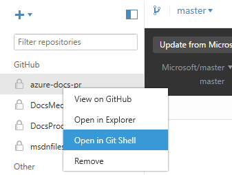
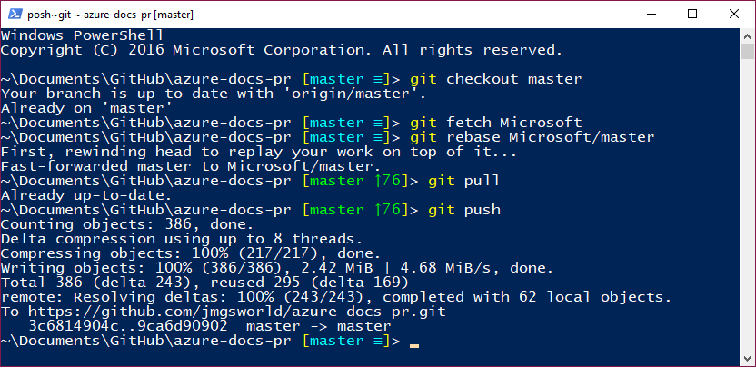
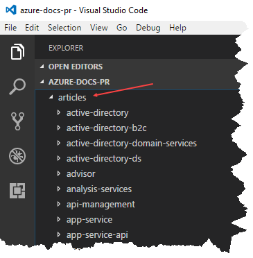
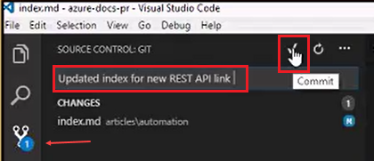
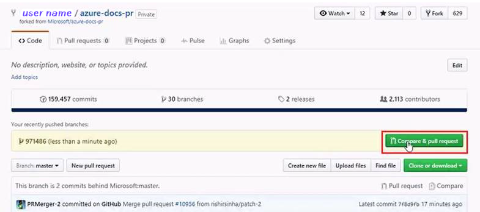
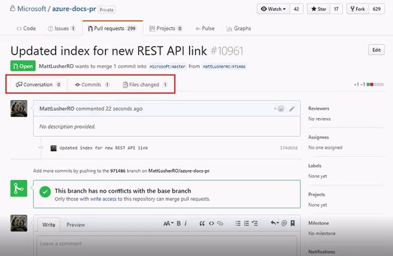
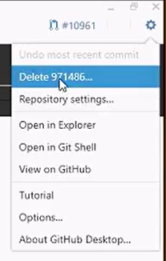
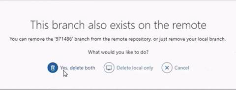

Workflow for GitHub Content Requests for Azure
==============================================

**Last Revised: 4/24/2017**

**PURPOSE**

Due to the complexities of working with Git, GitHub, the GitHub desktop client, and markdown-based files, the purpose of the reference guide is to make the end-to-end workflow process easy to follow. To the extent the Production Support Team can use this process, it will make handling requests more consistent, and easier for new team members to ramp up. Please provide any comments or requested updates to Michael Doran or John Grendahl.

**PRE-REQUISITES**

In order to process work requests for <https://docs.microsoft.com/en-us/azure>, the following pre-requisites are required:

*   Have a personal GitHub account set up at <https://github.com/join>

    *   Make note of your user name and password - you will need it later

    *   Add a shortcut or bookmark to <https://github.com> - you will refer to it often

    *   Best practice - have **Microsoft Edge** set as your default browser

*   Have the latest version of the [GitHub Desktop](https://desktop.github.com/) client tool installed on your local client

    *   NOTE: The desktop client requires two-level authentication to first connect and create a SSH public key for your client

        *   See [*Securing your account with two-factor authentication (2FA)*](https://help.github.com/articles/securing-your-account-with-two-factor-authentication-2fa/) for details on setting up 2FA

        *   Also, you can log into <https://github.com/settings/security> and click on the Two-factor Authentication **Edit** button

        *   After confirming your password, choose the Reconfigure two-factor authentication under Delivery options

        *   Here you can change your settings and set up phone authentication

*   Install the latest version of [*Visual Studio Code*](https://code.visualstudio.com/)

    *   A simple, lightweight version of Visual Studio that makes working with GitHub easy

**STEPS FOR INITIALLY CREATING A NEW FORKED REPOSITORY**

*   In the [GitHub](https://github.com/) web UI, navigate to the repository (aka **repo**) which contains the content you’ll be working with

    *   If not automatically signed in, make sure to sign-in first

    *   Repo for Azure: **Microsoft/azure-docs-pr** - <https://github.com/Microsoft/azure-docs-pr>

        *   Note that you will *not* be working directly in this repo and won’t have permissions

*   In the upper-right corner, click the **Fork** button

    *   Select your user account (should be listed)

    *   After a few seconds, the process will complete and you’ll be on **your** account page with the new fork displayed

    *   Also, the new fork should appear in your user profile under **Your repositories**

**CLONE THE NEW FORKED REPO TO GITHUB DESKTOP CLIENT**

*   Open the **GitHub desktop** client

*   In the [GitHub](https://github.com/) web UI, from your account page, select the repo you forked (if not already open)

    *   For Azure: **&lt;*Your user name*&gt;/azure-docs-pr** - [https://github.com/&lt;your user name&gt;/azure-docs-pr](https://github.com/%3cyour%20user%20name%3e/azure-docs-pr)

*   Click the **Clone or Download** button (colored button on right side)

    *   Click **Open in Desktop**

    *   Click Yes (in **Microsoft Edge**) to switching applications

    *   The **GitHub desktop** client will appear - select the location you want the files copied to

        *   The default is the **GitHub** folder under **Documents**

        *   Best practice - use this folder unless you have space issues

    *   After a few minutes, the new repo will appear under **GitHub** on the left side pane

        *   There will be no entries under **Changes** or **History**

        *   The files will show up in **Explorer** in the location you specified

        *   Note: testing this process on 4/24/2017 took ~8 minutes and copied ~4.5 GB of files locally

    *   Just below the branch dropdown list, click **View Branch** to show the current master branch

**SYNC YOUR LOCAL REPO WITH THE SOURCE REPO**

*   A forked repo will **not** stay in sync with the source repo without manual steps

    *   In the [GitHub](https://github.com/) web UI, you can see how many commits your fork is behind the Microsoft repo

    *   It is critical that you sync your fork with the Microsoft repo **before** starting work

*   The steps below should be followed **after** the initially cloning and **before** any work on files in this repo

    *   Open the **GitHub desktop** client

    *   Select your local clone of the forked repo (**azure-docs-pr**)

        *   Verify that the branch name at the top is **master**

    *   Right-click the repo name and select **Open in Git Shell**

*   A PowerShell window named **posh~git** will open

    *   The prompt will look something like **~\\Documents\\GitHub\\azure-docs-pr \[master ≡\]&gt;**

*   Type **git remote -v**

    *   This will confirm that the source repo is available for syncing

    *   The response should look something like (source repo alias highlighted):

        Microsoft https://github.com/Microsoft/azure-docs-pr.git (fetch)  
        Microsoft https://github.com/Microsoft/azure-docs-pr.git (push)  
        origin https://github.com/username/azure-docs-pr.git (fetch)  
        origin https://github.com/username/azure-docs-pr.git (push)

*   Note: **origin** is **your** fork’s repo on the GitHub server (remote repo)

*   Note: if you work with this repo all the time and *know* the alias, you can skip this step

*   Type **git checkout master** (to verify you are on the master branch)

*   Type **git fetch Microsoft** (the alias for the source repo you are working with)

    *   This will fetch all the latest commits

    *   There may or may not be feedback in the command window

*   Type **git rebase Microsoft/master** (the alias for the source repo branch you are working with)

    *   Adds any local changes to the latest changes pulled from the source repo

    *   The resulting \# in green is the \# of commits that need to be pushed to origin/master

    *   Feedback should be provided

    *   Feedback may state “Current branch master is up to date”

*   Type **git pull**

    *   This pulls everything from origin/master into your local master branch

    *   Feedback should be provided

    *   Feedback may state “Already up-to-date”

*   Type **git push**

    *   This pushes your changes back into origin/master

        *   Preconfigured as the auto push destination from the local master

    *   Your origin is now up to date with the source repo as well

    *   Your fork is now caught up to the source master (Microsoft/master)

    *   Feedback should be provided

    *   Feedback may state “Everything up-to-date”

*   When completed, the source repo, your fork’s repo, and your local clone should be in sync

    *   You can refresh the [GitHub](https://github.com/) web UI for your fork and it should state that your fork is even with **Microsoft:master**

*   Close the **Git Shell**

*   Return to the **GitHub desktop** client, make sure the local clone of the forked repo is selected, then click **Sync**

    *   After the initial forking and cloning, there will still be no **Changes** or **History**

**CREATE A LOCAL BRANCH FOR YOUR WORK**

*   Whenever you need to work in your fork, first sync your local repo using the steps above

*   Then, create your **new** bug branch from your **master** branch (**never** work in the master branch)

    *   This new ensures that your bug branch is current with the Microsoft/master branch

    *   **Only** work on one bug/work request in that branch

        *   See [Managing work in forked Git repositories](https://github.com/MicrosoftDocs/DocsProd/blob/master/prod-test/docs/git-tips/multiple-bugs.md) for details

*   To create a new branch:

    *   Open the **GitHub desktop** client

    *   Select your local clone of the forked repo (**azure-docs-pr**)

        *   Verify that the branch name at the top is **master**

    *   To the left of the branch designation, click on the **Create new branch** icon

    *   Enter the name of the new branch, then click **Create new branch**

        *   Best practice: Use the TFS bug/work request number for the branch name (example: 974460)

    *   The **GitHub desktop** client will create the new branch and automatically switch to it

        *   Note the change in the branch dropdown list at the top

*   Click the **View Branch** button on the upper left

*   Click the **Publish** button to publish your new branch to the remote forked repo

**MAKE AND COMMIT THE REQUESTED CHANGES TO THE FILE(S) IN THE BUG/WORK REQUEST**

*   Open **Visual Studio Code** (aka **VS Code**)

*   Click **File**, **Open Folder** from the menu

*   Navigate to the folder containing the files for that repo and click **Select Folder**

    *   Should be similar to **C:\\Users\\&lt;*your alias*&gt;\\Documents\\GitHub\\azure-docs-pr**

*   **VS Code** should be now open in the branch you just created

    *   Verify this via the branch name in the blur bar on the bottom left

*   Navigate to the file(s) specified in the bug/work request and make the needed changes

    *   For Azure Docs landing pages, they are located within subfolders in the **articles** folder

        *   Each landing page will have an **index.md** (or **index.yml**) and **TOC.md** file

        *   The Hub page is the **index.md** (or **index.yml**) file

*   Save and **close** the file

    *   The **Explorer** icon on the left will show the number of unsaved files

    *   Under **Open Editors**, select the file(s), then the **Save All** button

*   The **Source Control** icon on the left will now show the number of files waiting to be committed

    *   Click on the **Source Control** icon

    *   A message box appears under the heading Source Control: Git

    *   Type a short, but descriptive summary of your change

    *   Above the message box, click the **Commit** checkmark icon

        *   This commits the change from within **VS Code** and integrates with **GitHub**

        *   A blue line will indicate the status

        *   The bottom left corner will display the synchronization status of what is being pushed

*   Once the commit is made, return to the **GitHub desktop** client and select the History tab to view the commit

    *   This assumes you still have the **GitHub desktop** client open and have not changed repos or branches

*   Click **Sync** to sync the change with the new branch in the remote forked repo

**CREATE PULL REQUEST TO SUBMIT YOUR CHANGES TO THE SOURCE REPO**

*   In the **GitHub desktop** client, right-click on **azure-docs-pr** and select **View on GitHub**

*   There will be a highlighted area indicating “Your recently pushed branches:”

    *   Your branch name will appear along with how long ago the change was made

*   Click the **Compare & Pull Request** button on the right

*   Note: this action will transfer you to the **source** repo page in [GitHub](https://github.com/)

*   This action will create a pull request into the source repo master branch from your created branch in your local fork

*   Under the heading **Open a Pull Request**, confirm the base fork, base, head fork and compare values

    *   Should look like: **Microsoft/azure-docs-pr**, **master**, **&lt;*user name*&gt;**/**azure-docs-pr**, ***branch name***

*   Your commit comment should appear automatically

*   Add a message for the approver to see in the **Write** tab

*   Click **Create Pull Request**

**VERIFY THE BUILD AND THE RESULTS**

*   In the next screen, you can review the details of the commit in the **Conversation**, **Commits**, and **Files Changed** tabs

*   The center section will update automatically after some time (a few seconds to several minutes) to indicate that all checks have passed and there are no conflicts

    *   You should see an automatic **Validation status: passed** message

    *   If there are any conflicts in the steps above, they must be resolved before proceeding

*   You will receive an email notification from the **Open Publishing Build Service**

    *   It will indicate if the build was successful and include a link to the build report

    *   It should contain a preview URL so you can view the changes in GitHub

        *   The URL will be <https://review.docs.microsoft.com> plus **?branch=pr-en-us-*pullrequestnumber***

    *   Hover over any link additions or changes to verify they are correct

        *   Clicking the link as is will fail due to the pull request number designation being listed at the end

        *   Change the branch designation from **pr-en-us-*pullrequestnumber*** to **master** to verify

*   For Azure updates, write **\#sign-off** and the **bug number** in the **Write** tab near the bottom of the page

*   Click the green **Comment** button

*   Copy the pull request URL for later reference and use below 

*   Return to your fork in [GitHub](https://github.com/) and you’ll see the pull request option is gone

*   Since there are no permissions to this repo, you must wait to see if the approver accepts or rejects your changes

**FOLLOW-UP ACTIONS AND VERIFYING CHANGES ARE ACCEPTED**

*   Update the associated bug (should be the same number as the branch you created)

    *   Include the pull request (PR) link (copied as noted above) and the page review URL for the changes to be reviewed if needed

    *   Update the Sub-status to reflect the bug status (example: Fix in Code Review)

    *   Mention the people involved with the bus using an **@*alias*** (will generate email to those people)

        *   In the Discusssion section of the History field of the TFS project web UI, type "@" and wait a second or two to see the dropdown list of names to choose from

*   To verify that your pull request has been acted on:

    *   You should get an email indicating that the pull request has been merged, but don’t count on it.

    *   Navigate to the source repo that your fork and branch are based on in [GitHub](https://github.com/)

    *   Click on the **Pull Requests** tab

        *   If your pull request is still on the **Open** list, it has not been acted on

        *   If your pull request is not on the **Open** list, click the **Closed** option

            *   Click on the pull request title hyperlink to see the details

            *   If the pull request has been merged, proceed to delete the branch you used for the request

            *   If the pull request was rejected, take the necessary actions as indicated in the request

**DELETE BRANCH FROM YOUR FORK**

*   **After** the pull request has been accepted, **delete** the branch created for the bug fix as a best practice

    *   Open the **GitHub desktop** client

    *   Select **azure-docs-pr** and the applicable branch

        *   Note: by using the **GitHub desktop** client, you can delete *both* the local and remote branch

    *   Select **Tools and options** (gear icon)

    *   Click **Delete *branch name***

*   A message will appear informing you that the branch also exists on the remote repo

*   Click on **Yes, delete both**

*   The branch designation in the branch dropdown will change to **master**

*   Return to your fork in [GitHub](https://github.com/) to verify that the branch is removed

**RESPOND AND RESOLVE WORK REQUEST**

*   After the pull request has been accepted, respond to the bug submitter with the details and resolve the bug as fixed

    *   Note: once the fix has been merged, the preview link will not work anymore
