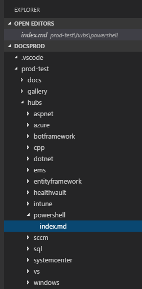
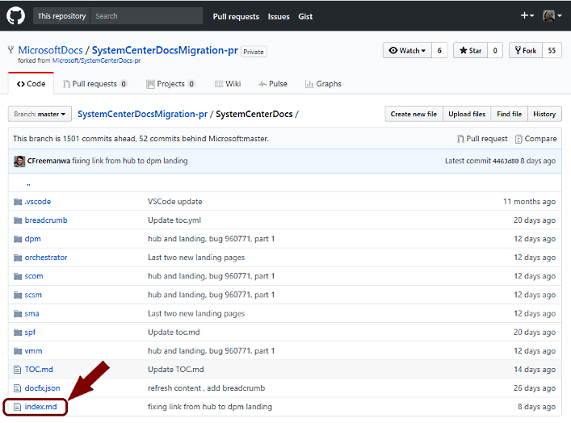
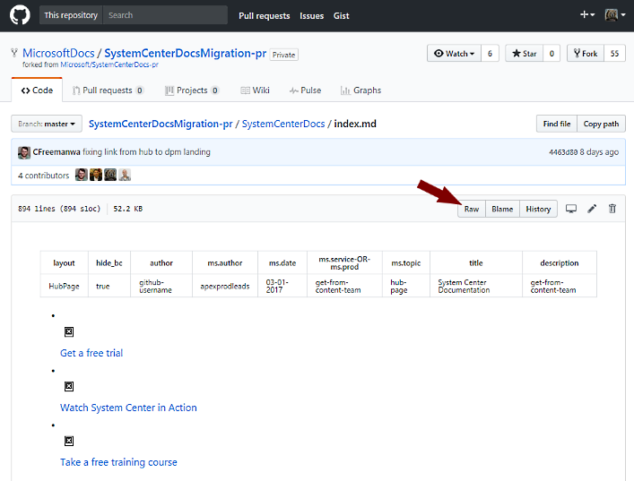

# Working with hub pages
The APEX Production team has primary responsibility for building and maintaining hub pages, which are the main pages for each product or technology on docs.microsoft.com. Examples:
* [Windows](/windows/)
* [Azure](/azure/)
* [Visual Studio](/visualstudio/)

The Markdown source files for these pages live in the DocsProd repo (the same one that contains this page), under /prod-test/hubs/. Within each subfolder is an index.md file containing the hub page source.



## Evaluating hub page requests
It’s important to remember that hub page requests may, or may not, be appropriate. Here are some ways in which the request may not be:

* The submitter is asking for a hub-style page, but they want it where a landing page is supposed to go; that is, as the index for a subset of their docs repo. Hub pages only go at the root level; it’s a style for repo home pages.
* The request includes specs for features our hub page layout doesn’t support. If something in their proposed layout doesn’t already exist in our template or on one of our hub pages, that’s a red flag; don’t simply hand-crank HTML to make it work. 
* The request requires using existing hub page features in an inappropriate manner: placing features in the wrong place, customizing features, or using them in ways they weren’t designed for&mdash;say, cardsC with no image, or with no background.

Beyond such issues, a request may simply be inactionable. The submitter may have submitted a request with no details at all; or incomplete content; or other issues. 
For any requests that are inappropriate, incomplete, or present any other issue that either makes it impossible to implement, or raises questions in your mind as to whether to implement, STOP. Don’t implement the bug. Instead, make note of your questions in the bug, @mention the submitter, and @mention Jason Groce and Kim Tapia St. Amant.

## Creating a new hub page
New hub pages are based on the hub page template, also in DocsProd, at /prod-test/templates/template-hub.md. The template contains the standard metadata and a complete layout for you to customize to the specs presented in the bug you’re working from. Alternatively, you can review existing hub pages and copy from the one whose structure is closest to the one you’ll be building. Since it’s a new page, you can work in the master branch; there should be no conflicts.

You’ll notice that rather than being pure Markdown syntax, the page is mostly HTML code. That’s OK; Markdown allows injected HTML code. You’ll be customizing it to create the hub page you’re working on.

### Metadata
The hub page template supplies a standard list of metadata at the top of the file:

```markdown
---
# aka.ms/skyeye/meta for more information
layout: HubPage
hide_bc: true
author: github-username
ms.author: apexprodleads
ms.date: 03-01-2017
ms.service-OR-ms.prod: get-from-content-team
ms.topic: hub-page
title: Hub Page Title
description: get-from-content-team
---
```

Of these items, the only ones you need worry about are author (enter your GitHub username, in all lowercase), title (for which you should have the page title in the bug you’re working from) and description (which should come from the page copy’s introductory info; if it’s not there, ask the submitter). 

### Page structure
Hub pages include a page title styled as a h1 tag, followed by any intro text, and optional elements for a set of features at the top, or an "adholder" block that appears at the top right. The features block (for an example, see Azure) and the adholder are mutually exclusive; you can’t use both on the same page, as they overlap each other on the rendered page. If your bug calls for both, contact the submitter and discuss.

After the page title, intro, and optional elements, the page structure is composed of pivots, panels, and cards. Pivots are the top tabs across the page (see any example hub page); they’re the primary block structure of the hub page. Each pivot contains one or more panels; if more than one, a left nav of all the panels will be displayed. On each panel are cards; they render as a block of content, with or without images depending on the card type (see Card types below).

In the source code, these structures are built as a set of nested ul tags, each with its own set of li tags. At the card level, each card is represented by an li tag containing a div structure for the card. Study this structure in the hub page template and review example hub pages to understand how this structure works.

### Card types
Most elements in the hub pages are built out of an HTML structure termed a "card", which (for most card types) contains a subsection for an image and another for the card’s text. See the card gallery for examples of each card type. You can open /prod-test/gallery/card-gallery-internal.md or /prod-test/gallery/card-gallery.md in your code editor to view and copy any particular card types. 

Note: The cardsC card type requires a colored background on all images. This is achieved by adding the "bgdAccent1" class to the div that has the "cardImage" class. 

### Images
Images in a hub page come from the DocsMedia repo. In that repo, you’ll find the folder /media/hubs/ for any hub-specific images; create a subfolder for your hub (its name should match the name of the folder you create in DocsProd for the hub page itself) and load your hub-specific images in there _before_ you build your hub page. For icons and other general images images, check the other folders:

* /media/common
* /logos

Other folders in this repo aren’t relevant to hub pages. For any new images you have, load your images into the DocsMedia master branch, commit your changes, and push them to kick off a build; this way, they’ll be available to use in your hub page.


## Hub page workflow
Unlike landing pages, which are built in a fork of the destination docs repo, hub pages are built in the DocsProd repo. This means that the workflow and Git practices are different. 

### New pages: Draft in the master branch
Unlike landing pages, since you’re working in a repo owned by APEX Production, and since you’re building a new page that no one else is working on, it’s actually safe, and recommended, to work in the DocsProd master branch. 

1. Make sure you fetch the latest commits for the master branch from origin before you start your work. 
2. Open the hub page template and save it in a new subfolder of /prod-test/hubs. Name the new subfolder according to the product it represents; use all lowercase and place hyphens where any spaces would go. Within that new folder, name your new hub page file **index.md**.
3. Complete the process of building the page and commit your work.

### Existing pages: Create a branch and copy the latest version
Unlike a new hub page, on which you’re the first, and therefore, only person to work on it, existing hub pages are subject to change from multiple sources: 

* Someone may be working in the same hub page as you, but for a different bug. 
* Since the last time the hub page was updated by APEX Production, it’s possible the page was edited in its destination repo by its own docs team. (They’re not supposed to, but there’s nothing preventing them from doing so.)

Upshot: if you simply work in the master branch, you risk combining your changes with those from another bug; and if you don’t check the latest from the destination repo, you risk losing changes made by the docs team. So, you need to follow these steps to ensure you’ve got the latest good copy and you’re not mixing changes with anyone else: 

1. Make sure you fetch the latest commits for the master branch from origin before you start your work. 
2. From the master branch, create a new branch named after your bug.
3. Open the index.md file for the hub page you’re working on.
4. Open your browser and navigate on GitHub to the source repo for the hub page’s destination: for instance, https://github.com/MicrosoftDocs/systemCenterDocsMigration-pr.
5. Navigate to the hub page’s index.md file in the repo and open it:  
      
    

6. When the file view opens, select Raw to open a new browser window with the raw text of the hub page file:  
      
      

7. Now you can copy the text of the file and paste it into the index.md file in your bug branch. 

These steps will ensure you’re working from the same version of the file that your submitter sees, and that your work won’t interfere with anyone else’s. Later, when your bug branch is merged back to master, there may be merge conflicts with the master branch; these can be resolved then. For now, and until your work is posted to the source repo again, you’re clean.

> Note: Because you’re working on an existing hub page that will be posted to another repo, you may be tempted to post any new graphics in that destination repo. DON’T. ALL hub page art goes in the appropriate folder in the DocsMedia repo. This is one of the ways we control design. Furthermore, any images for a hub page should come from our own design team: if the submitter requests that you use images they’ve provided, refer to Kim Tapia St. Amant (design lead) for review.

### Push to build and review
When your page is complete, simply push your changes to origin to kick off a build. Once your page is built, check it in preview first, then place the preview URL in the bug and @mention the bug submitter and anyone else interested in the page. At a minimum, this should include Jason Groce, Kim Tapia St. Amant and Valerie Rosen (graphic artist). If, on checking the page in preview, you see any images missing, double-check that you’ve previously pushed any new images you placed in the DocsMedia repo.

Review and revision can continue in DocsProd/master. Once the page is final and signed off, you’re ready to post it to the repo where it will be actually published.

### Post-signoff: transfer to destination repo
Once the new page is ready to post, there are two possible paths for it to take:

* The submitter will simply go to the DocsProd repo themselves and copy the new page out, then paste it into their repo. Check to see whether they plan to do this.
* You’ll need to post it to the destination repo on Github. To do this, you’ll need to follow the steps in [Publishing to other repos](./repo-publishing.md). As those steps indicate, find the repo you need, fork it, make a bug branch in your fork, and then take your index.md file and copy it over the index.md file for the repo. Since both hub pages and landing pages get the name index.md, make sure you’re copying over the index.md for the repo’s hub page; it should be at the root level of the repo, or at the top level of the docs folder. Push your bug branch up to your origin (your fork on the GitHub server), then create a pull request back to the original repo, copy the URL to the PR into your bug as well as the preview URL from the PR build report, and @mention the submitter.

> Finding the right repo: Most established repos are listed at the bottom of the [Publishing to other repos](./repo-publishing.md) page; if the one for your page isn’t listed, contact the request submitter and ask them which repo, and which branch, to issue a PR to.

### Closing the bug
At this point, the bug is in your submitter’s hands; you can move on to other things. Once the owner of the repo signs off on your PR, you can resolve the bug back to the submitter.
