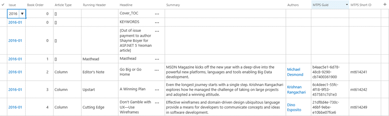
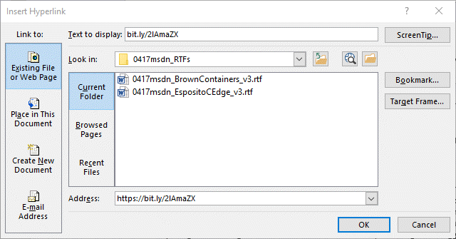
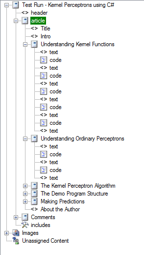
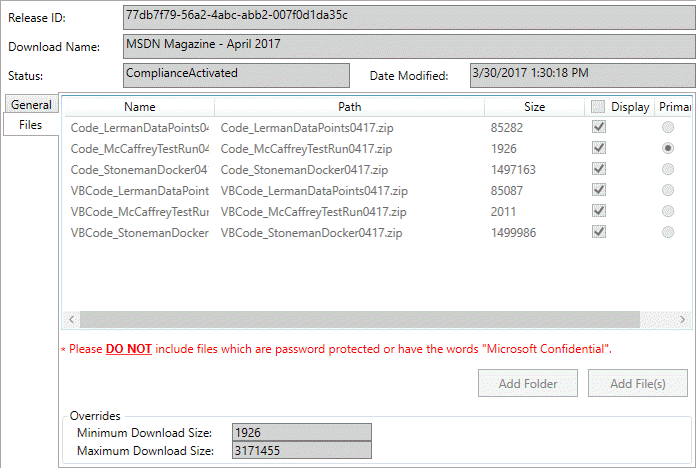

# MSDN Magazine process

This document outlines the tasks and tools that are needed to publish the MSDN Magazine online on a monthly cadence. 

## Building structure in PublishThis!
Information about the articles is posted to [SharePoint](https://sharepoint.partners.extranet.microsoft.com/sites/msdntnpub/msdn/default.aspx) by the magazine team. They will notify you when the content is available to begin work (approximately on the 10th each month). 

Create a new issue page in PublishThis! for the month. Use the Magazine_Issue_Page layout when creating the page, and be certain to **check the 'Render in  EPX with EPX behaviors' option**. The Content Title should be the month and year of the issue.  


The issue page should have an **alias of MMYYmag**, for example 0417mag. This is used by the physical magazine when referring to the website.

* In PublishThis!, open the TOC for the year, and add the new month's issue to it *at the beginning of the list*.
* For each article in that month's issue, create a new page in PublishThis!. Use the Magazine_Article_Page layout, and **check the 'Render in EPX' option**.
  * Add the article to the TOC for the issue
  * Copy the Content ID and GUID from the page properties dialog. Add this information to the SharePoint site for the article (in the MTPS Short ID and MTPS Guid fields).  

  * Save and check-in the article page using PublishThis!
* Once all the articles have been created, create an Excel spreadsheet. This will be sent to the localization team.
  * In SharePoint, click the List tab and select Export to Excel
  * Click Enable on the Security Notice dialog
  * Enter your credentials if prompted
  * Filter the spreadsheet to only include the content for the issue
  * Save the spreadsheet. Attach it to the work request for the issue, and with the localization work request (see Localization request later in this document)

## Converting articles
The articles for each issue are provided as a ZIP file containing multiple RTF files and require some formatting before adding to PublishThis! Images are provided in a separate ZIP file. Use the PDF files for each article (provided in a separate ZIP file) as reference to the final article appearance. These three files are posted to the [SharePoint](https://sharepoint.partners.extranet.microsoft.com/sites/msdntnpub/msdn/Content%20Repository/Forms/AllItems.aspx) site for each month.

### Article content
The article needs preparation before being added to PublishThis! You will need to perform the following tasks.

#### Convert all headings
The headings in the RTF files are formatted, but do not have a style. Convert all headings within the article to H2. If subheadings exist in the document, convert to H3.

Occasionally there are bold items at the beginning of paragraphs. These are formatted with a semi-bold font and should be converted to bold.

#### Place all figure captions and code samples
When provided, all the figure captions and longer code samples are provided at the end of the RTF file. In addition, the figure references are formatted using a semi-bold font.

Reformat the figure references to be bold (rather than simply styled with a semi-bold font).

Copy the figure caption and/or code from the bottom of the document to just under the first reference for that figure.  


#### Convert all hyperlinks
The Magazine editors do not include the protocol when posting URLs (or email links). For each URL, convert it into a hyperlink in Word. Select the link text, and copy it. Right click and select Hyperlink... from the menu. Add the protocol to the Address field and paste the text.  


In the case of email addresses, select the Email Address option in the Add Hyperlink dialog sidebar and add the appropriate address to the E-mail address field.  


### Images
Images are provided in TIFF and AI formats. These need to be resized and converted to PNG/JPG for use.

It is easiest to use a batch processing tool for the TIFF files. Resize them to 800 pixels wide using proportional scaling. If the image is small, such as a mobile screen, or very high, you can set them to a narrower final image. Convert them to PNG, unless they are photographs, which will be JPG.

AI files must be converted to PNG using PhotoShop or Adobe Illustrator. Save them as PNG files, no more than 800 pixels wide.

Columns will also need a headshot graphic in the article. These are available on the [SharePoint site](). They are included in the following article types:
* Editor's Note (Michael Desmond)
* Cutting Edge (Dino Esposito)
* Data Points (Julie Lerman)
* Test Run (James McCaffrey)
* The Working Programmer (Ted Neward)
* Essential .NET (Mark Michaelis)
* Modern Apps (Frank La Vigne)
* Don't Get Me Started (David Platt)

Import all images into each article in PublishThis! 

## Publishing articles in PublishThis!
Articles are composed of XHTML and Code Highlighter blocks. The page structure can be simplified by grouping these blocks into Container blocks.  


In addition, there are separate XHTML blocks for the page header, title, and 'about the author' sections.

The CSS Class for the top-level item for an article should be set to 'mag'. This is added if you create the page using the Magazine_Article_Page layout. In addition, all of the blocks for the article should be added to a container block with the CSS Class 'article'. Again, this is set up if you use the layout to create the content item.

### Page Header
The page header is the same for all articles in the magazine issue. This should be the first item in the page structure for the article. It should consist of a horizontal rule, the month and year of the issue, and the current issue volume and number. These last two are available from the magazine publishers or the PDF for the home page.

Here is a sample page header:
```
<hr xmlns="http://www.w3.org/1999/xhtml" />
<div class="issueDate" xmlns="http://www.w3.org/1999/xhtml">April 2017</div>
<div class="issueNum" xmlns="http://www.w3.org/1999/xhtml">Volume 32 Number 4</div>
```

### Page Title
The page title block should have the CSS Class FeatureTitle and consists of the following content:

* H1 consisting of the article running header and headline (from the SharePoint site).
* A link to the page that includes all the author's articles. Currently, this is the content ID mt149362. The page takes a single parameter: the author's name. Replace all spaces with '+' characters. See the sample below for an example.
* The month and year of the article.
* A link to the code sample(s) for the article. If there are no downloads, do not include this link. If there is only a single code download, have the text 'Get the Code' with a link to the code. If there are multiple code samples (for example both C# and VB versions), the 'Get the Code' should not be linked. Include the downloads after, with a label describing the language of the download.

Here is an example title section. This includes two downloads.

```
<h1 xmlns="http://www.w3.org/1999/xhtml">Test Run - Kernel Perceptrons using C#</h1>
<p xmlns="http://www.w3.org/1999/xhtml">By 
<a href="mt149362?author=James+McCaffrey">James McCaffrey</a> | 
April 2017 | 
Get the Code: <a href="http://download.microsoft.com/download/7/7/D/77DB7F79-56A2-4ABC-ABB2-007F0D1DA35C/Code_McCaffreyTestRun0417.zip">C#</a>
   <a href="http://download.microsoft.com/download/7/7/D/77DB7F79-56A2-4ABC-ABB2-007F0D1DA35C/VBCode_McCaffreyTestRun0417.zip">VB</a>
</p>

```

### About the author
The About the author section is the last section in the article. It consists of a horizontal rule, and the author bio from each article. The author's name should be in bold, and the remainder of the text in italics. Any spaces between these two elements will be removed on rendering, so **include a non-breaking space between the elements**.

```
<hr xmlns="http://www.w3.org/1999/xhtml" />
<div xmlns="http://www.w3.org/1999/xhtml">
	<p><strong>Dr. James McCaffrey</strong>&nbsp;<em>works for 
  Microsoft Research in Redmond, Wash. He has worked on several 
  Microsoft products including Internet Explorer and Bing. 
  Dr. McCaffrey can be reached at <a href="mailto:jammc@microsoft.com">jammc@microsoft.com</a>.</em>
  </p>
</div>
<div xmlns="http://www.w3.org/1999/xhtml">
	<p>Thanks to the following Microsoft technical 
  experts who reviewed this article: Ani Anirudh and Chris Lee</p>
</div>

```
Occasionally, the reviewers will also have a bio. This can be seen on the SharePoint site on the Technical Reviewers column. If this is included, add it at the bottom of the about the author section (after the 'Thanks to...' line).

### XHTML blocks
Generally, the formatting is carried over from the Word document into PublishThis! There are some exceptions, as outlined below.

#### Intro block
The first XHTML block in each article is used for the introduction of the article. This is typically the first block of text in the article, before any headings. For columns, you should include the headshot of the columnist. The headshot image should be the first item in the first XHTML block after the title block. The **headshot should have the CSS style 'headshot' included for formatting**.

#### Sidebar blocks
Some of the articles include sidebar content. They appear with a blue background in the PDFs, and are in the Word documents below the figure references.

Copy this sidebar content into a separate XHTML block. **Set the CSS Class for the block to 'aside' to format it**. The location of this sidebar should approximate where it is located in the PDF version of the article.

#### General formatting issues
As described above, most of the formatting from the Word document will be correct in PublishThis! with the following main exceptions:

* Lists - These will not have the correct formatting. Select the entire list, and convert it into the correct list type (unordered or ordered) with the buttons on the PublishThis! toolbar.
* Tables - Delete any column sizing from the table XHTML. Add a class attribute of 'charttable'.
* Images - Place the image before the figure caption text, with a line-break separating them. Use the text of the figure caption (not including the text Figure #) as the alt-text for the image.
* Code - Unlike images, **with code samples, the figure caption goes before the code sample**. Delete the bold styling and add a class attribute of 'codeCaption'. See below for an example.

```
<div class="codeCaption" xmlns="http://www.w3.org/1999/xhtml">
Figure 3 Kernel Perceptron Demo Program Structure</div>
```

### Code Highlighter blocks
The language should be set appropriately for each code highlighter block. In addition, the 'hide line numbers' option should be checked. 

If the language is in question, ask someone. However, usually it is obvious from the article text (usually C# or JavaScript). For content that 'looks like code, but isn't', use the XML language option.

> It's not actually essential you get the language correct. The styling on the site actually hides the text showing the language of the code. Still, it's a good practice to set this correctly.

You will need to remove extra blank lines from the code in the code samples. 

## Other pages for each issue
In addition to the articles, each issue also requires a home page as well as changes to other pages on the Magazine site.

### Home page
When you create the issue page using the Magazine_Issue_Page layout, it adds a single article in the articles container. You will need to duplicate this item for the number of articles in the issue. Each article consists of the following XHTML.

```
<div class="articleBlock" xmlns="http://www.w3.org/1999/xhtml">
	<div class="articleImg"><a href="/magazine/mt797653">
    
      <span class="articleCategory">Column</span></a></div>
	<h2 class="articleTitle">
  <a href="/magazine/mt797653">Test Run - 
  Kernel Perceptrons using C#</a></h2>
	<div class="articleAuthor">
  <a href="/magazine/mt149362?author=James+McCaffrey">James McCaffrey</a>
  </div>
	<p>Unlike ordinary perceptrons, which can perform binary classification on simple, linearly separable data, 
  a kernel perceptron can be used to handle 
  non-linearly-separable data. The demo program 
  in this article creates   a prediction model 
  using a kernel perceptron, as James McCaffrey explains.</p>
</div>
```

For the image, you can either create a new image (450x306 in size), or select one of that size from the [DMC Image Assets](https://microsoft.sharepoint.com/teams/DPEPortal/FieldCommunity/Pages/DMCImageAssets.aspx) page. These images are not posted on the live site, so they should be **added to the issue page images**.

> Try for a mix of the abstract images in that list, and the 'real people' images for each issue. Hopefully, you will enjoy attempting to pick out yet another image for yet another article on Entity Framework or software architecture.

Articles that are not columns do not include the articleCategory span. Columns are those articles from the standard authors, and include:
* Editor's Note
* Upstart
* Cutting Edge
* Data Points
* Test Run
* The Working Programmer
* Essential .NET
* Modern Apps
* Don't Get Me Started

The remainder of the content is from the SharePoint site.

The order of the articles in the section should be:
* First item is the featured article. This is the one highlighted on the top right of the cover page PDF (also usually the first one listed on the cover).
* Alternate between feature and columns in the same order as on the SharePoint site, except:
  * Editor's Note is always the last item.
  * If there is an Upstart column, it goes just before the Editor's Note article.

You will also need an image of the issue home page. The easiest way to get this is to take a screenshot of the issue home page PDF. Resize it to 239x179 and save as JPG. The image should be less than 10K in size, so set the quality setting appropriately. The image should be called cover_lrg.jpg for consistency.

> If you look at older and current (as of April 2017) issue pages, you will also see two other cover images - cover_med.jpg (179x148px), and cover_sml.jpg (95x71px). These are no longer needed - they used to be used on the Issues and year pages, but are now only created as I'm too lazy to stop.

### Issues and download page
The Issues and Downloads page includes references to the current year of issues, and previous ones. 

For the current year, each month is composed of the following XHTML:
```
<div class="issueBlock" xmlns="http://www.w3.org/1999/xhtml">
	<div class="issueImg"><a href="/magazine/mt797643"></a></div>
	<div class="issueTxt">
		<h3>April</h3>
		<p><a href="mt797643" title="April 2017 Online Version">Read Online</a></p>
		<p>Digital Download<br />(coming soon)</p>
		<p><a href="0417magcode" title="April Code Downloads">Get the Code</a></p>
	</div>
</div>
```

The image is the cover image created when working on the issue home page, which is the target for the image and "Read Online" links. The code download page is created below.

The digital download link is to a PDF copy of the magazine. These are posted on the SharePoint site after a one month delay (i.e. the PDF of the January issue is posted in February). You willl need to publish these to the Download Center using DMS and the link added to the issues page. Once the link is added, you can remove the "(coming soon)" text.

All previous years only have links to the issue and download page, no image. 

### Year page
The year page consists of the same content as the current year from the issues page.

### Right rail page
The right rail includes a link to the current issue. This is included on every page on the iroot. **You need to update the image and link each month**. The section to update looks like:

```
<div style="text-align:center;display:block;height:260px" xmlns="http://www.w3.org/1999/xhtml">
			<p><br /><a href="/magazine/mt797643"></a></p>
		</div>
```

In addition, you should replace the cover_lrg.jpg in the images section of this page with the version for the current month you created in the home page section above.
> It's duplicated as the version here is used by another site on MSDN (Subscriptions, I think).

## Code Downloads
Code downloads are published using [Download Management Studio](http://downloadservice/managementconsole/) (DMS). The C# version of the code downloads will be provided by the magazine people, with any VB version provided later in the month after translation. The files are posted to the [SharePoint](https://sharepoint.partners.extranet.microsoft.com/sites/msdntnpub/msdn/Content%20Repository/Forms/AllItems.aspx?RootFolder=%2Fsites%2Fmsdntnpub%2Fmsdn%2FContent%20Repository%2FCode%20Downloads&FolderCTID=0x012000630C8A5650504041A5CEA2795174E60A&View=%7B2323270B%2D6D67%2D49DC%2D8B42%2D635474EEDAA4%7D) site each month.

**Wait until you have all the downloads before publishing**. In DMS, create a new download for each month.  


Add a release for the actual files and all all available downloads. Assign it to Jason Groce for approval.  
  


Submit the download for compliance and publish once that is complete. The downloads themselves can be published before the first of each month.

Add the URLs from the DMS on the article page, and the Code Downloads page for each month. You can get the URLs in DMS from the Downloads > View File Paths menu.

The Code Downloads page is a simple list with the articles that include code downloads. **It should have an alias with the month: for example 0417magcode**. This is used in the paper edition of the magazine.  


## Publishing the magazine
To guarantee the end-user sees the new issue appropriately, the new issue should be published in this order:
1. Publish the ToCs for Issues and Downloads, Year, and Issue
1. Publish the articles
1. Publish the downloads and code download page
1. Publish the issue page
1. Once the issue page is live, and all articles have been confirmed, update the Home page (dd767791) for the magazine by replacing the existing Page Content section with the content from the current issue. Once updated, publish the home page.

## Localization request
Once the content has been built in PublishThis!, you need to send a request to the localization team to begin work on the article. This can (and should) be done before the issue has been published.

The localization request is made on [APEXHelp](https://apexhelp/). 
* Select PT! and SMS Content Updates and click “Accept” on Authorize application  

* Fill in necessary information and make sure selecting “Request Change to Weekly Update” under “Request Type” and “MSDN” under Site, in order to auto assign the ticket to LIOX production team.  If you add your email alias under Email Copy of Submission, you will receive email notification with the TFS ticket for future reference.  

* In the description of the request, include the names and URLs for the top six articles to be localized. Ask Michael Desmond (Magazine Editor-in-Chief) if needed.
* Add the spreadsheet created in "Building structure in PublishThis!" as an attachment.


## Publishing RSS
RSS is publishing on the docs.microsoft.com platform. This should be done after the issue has been published.

The items for each article are added to the main RSS file (in the [msdn-files repository](https://github.com/MicrosoftDocs/msdnfiles/tree/master/msdn-files/feeds/MSDN/en-us/magazine)). Each item should include one or more category elements
that identify the topic of the article, and one category element per author.

```
<item>
<guid isPermaLink="false">B90F3B6F-618B-422B-91E1-232D4150B0BD</guid>
<title>Betting on Bots</title>
<description>Microsoft has been pushing hard on bots 
and what it calls "conversation as a platform." 
What does it mean for developers?</description>
<pubDate>Wed, 01 Mar 2017 10:00:00 GMT</pubDate>
<link>http://msdn.microsoft.com/magazine/mt795181</link>
<atom:author><name>Michael Desmond</name></atom:author>
<category>Editor's Note</category><category>Michael Desmond</category></item>
```
Validate the RSS file using the online [FeedValidator](http://feedvalidator.org/). Note that you will get errors for multiple author tags, but they're wrong on this one.

For more details on publishing the RSS file, see [Publishing supplemental content](publishing-supplemental.md).

## Adding Comments

Once the issue has been published, you can add the comment section to each article. 

The comments are currently being hosted by the MSDN Forums. Each article has a thread in the MSDN Magazine forum. Authors are requested to monitor the threads for their articles. It is also monitored by the magazine publishers.

The comment section consists of an XHTML block pointing at the thread, and an RSS feed viewer pointing at the RSS feed for the forum.

* Create a new thread on the [MSDN Magazine forum](https://social.msdn.microsoft.com/Forums/en-US/home?forum=msdnmagazine&filter=alltypes&sort=lastpostdesc)
  * Select the "Start a discussion" option
  * Add the title and description of the article
  * Include a link back to the article within the description of the article. This usually takes the form of:
  ```
  <p>Read this article in the <a href="https://msdn.microsoft.com/magazine/mt795180"> March 2017 issue of MSDN Magazine</a></p>
  ```
* Add an XHTML block to the article with a link to the forum thread
```
<hr xmlns="http://www.w3.org/1999/xhtml" />
<p id="comments" xmlns="http://www.w3.org/1999/xhtml"><a href="https://social.msdn.microsoft.com/Forums/en-US/b007ae68-39f9-4c93-9c33-cd7393990822/the-working-programmer-how-to-be-mean-angular-components?forum=msdnmagazine" target="_blank">Discuss this article in the MSDN Magazine forum</a></p>
```
* Add an RssFeed behavior to the page. The RssLocation property should be from the forum thread. Right click on the RSS feed icon to get this URL. It will take the form: https://social.msdn.microsoft.com/Forums/en-US/msdnmagazine/thread/49e19c82-b623-4ac5-8323-27d248572986?outputAs=rss  
  


* Republish the article with the added comments.