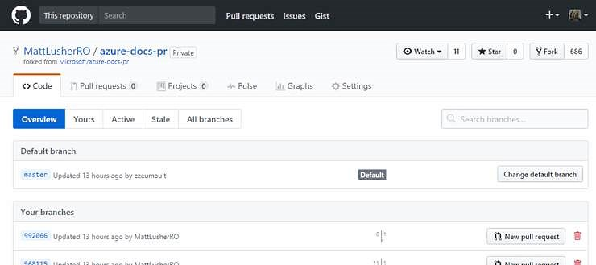
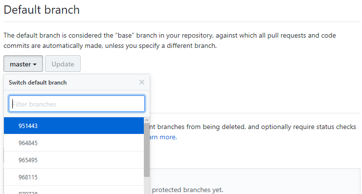

# Deleting and recreating your master branch in forked repos

Sometimes, while working with your own fork of a repo, you may find that&mdash;due to problems you can't track down, such as file corruption or configuration error&mdash;you can no longer sync your fork's master branch with its source repo. 

When this happens, it can be the easiest and most convenient solution to simply delete and recreate your master branch from the source. This clears out whatever is causing the problem and gives you a clean start.

Before you can conisder doing this, though, you must be sure you have no pending work in your master branch. If you've been following best practices, however, and not working in the master branch, this should be no problem. If you do have any of the following in your master branch, though, you're going to need to save your work first: 

* Changed files you haven't staged
* Staged changes you haven't committed
* Commits that haven't been merged back to the source repo
* Opened pull requests from your master branch to the source

All this work will be lost if you delete and recreate your master. Before you start the process, then, make sure you clear this work out: 

1. Stage and commit any files you are working on.
2. From your master branch, create a new branch; this will carry those committed files. Give your new branch an appropriate name, such as master-temp.
3. Make note of any open PRs and the files in them. Deleting your master branch will close those PRs and you may need to recreate them as new PRs, so you'll need to know which files to include.

When you're sure your master branch has no outstanding work, you can begin the process of deleting and recreating it. As long as you **don't do any work in your fork while you're doing this,** it's a safe process. Here's how:

## Change your default branch 
Master is the default branch, so by default, it can’t be deleted. The first thing to do, then, is select a different default branch. 
1.	Open your fork repository on GitHub.
2.	From the repo’s home page, select Branches. You’ll see this:  
  
  

3.	On the right, select “Change default branch”. This takes you to the Default branch screen. Selecting the dropdown showing “master” gives you a list of branches to choose from:  
  
  
    
4. Select any branch you want from the list; it doesn’t matter, so long as you **DON’T DO ANY WORK IN THIS REPO** until you’ve completed this process. Click Update, confirm in the dialog with the red-text button, and you’re done.

## Delete your master branch
Now, you can delete master branch as you would any other in the repo. I find this easiest to do in GitHub Desktop. 
1.	In GitHub Desktop, select your repo and then select the master branch. 
2.	Select the gear icon in the upper right and then select “delete master”. If this is grayed out, you haven’t changed your default branch; start over.
3.	You’ll get a dialog from GitHub desktop saying the branch exists locally and on the remote; choose to delete both.

## Recreate your master branch
Next, you need to recreate your master branch. This is easiest to do in the Git shell.
1.	Right-click on your repo in GitHub Desktop and select **Open in Git Shell**.
2.	Once you’re in Git shell, execute the following git commands:  

    ```git fetch Microsoft``` (or ```MicrosoftDocs```, if that’s the organization for your source repo; use ```git remote``` to find the right one)  
    ```git checkout --track Microsoft/master``` 
    ```git push -u origin master```
  
Now you’ve got a new, clean copy of the source repo’s master branch, and you’ve set it up to push to your own origin.

## Reset master as your default branch
Go back to Github in your browser and follow the same steps you did when you selected a different branch as default, only this time choose your master branch. You’re done!


