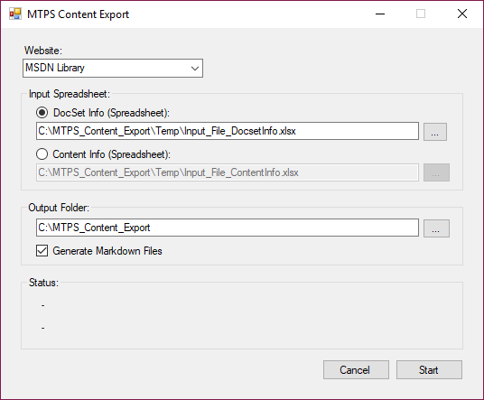
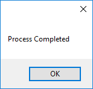

MTPS Migration to Docs Pilot Project
====================================

**Last Revised: 4/28/2017**

## Goal
Extract content XHTML from the MSDNContentCache database (aka MTPS database) based on two specific docsets (Build System) from the Patterns & Practices product family (**pandp**), export the data to markdown (\*.md) files, then subsequently render the content in the docs.microsoft.com platform.

## Prerequisites
In order to export and convert the content, the following prerequisites are required:
1. Have the latest version of the **MTPS Content Export** client tool copied to your local client.
    *   Source: [\\\\RR1VSCSVM01\\Public\\Bivin\\MTPS\_Content\_Export](\\RR1VSCSVM01\Public\Bivin\MTPS_Content_Export). Copy the entire MTPS Content Export folder to the C: drive of your client.
2. Determine folder locations for source spreadsheets (C:\\MTPS\_Content\_Export\\Temp is the default).
3. Obtain read permissions to the MTPS reporting server (reporting.mtps.glbdns2.microsoft.com) if needed.
    *   Security group to join: **MSDN Reporting** (one for each domain - tell the POC which domain you are in)
    *   POC for permissions: **APEX Site Reliability Engineers**
4. Install the **Pandoc** universal document converter (<http://pandoc.org/installing.html>).
    *   Select pandoc-1.19.2.1-windows.msi (or latest version) as the file to download, then run the install (execute the .msi).
    *   It’s a command line tool executed by the **MTPS Content Export** client tool, so no further work with Pandoc directly should be needed.

## Steps for running the MTPS Content Export CLient Tool (Build system docsets)
Exporting and converting Build System content utilizes the docset name, locale, productName, and productVersion.
1. Navigate to the folder containing the **Input\_File\_DocsetInfo.xlsx** file (C:\\MTPS\_Content\_Export\\Temp).
2.  Open the file, verify that there are **no** entries in rows 2 and 3, and add the following values for the first docset:
    *   **guide-Prism-4-201011** in row 2 under the Docset Name column header (contains 44 pages)
    *   **en-us** in row 2 under the Locale column header
    *   **pandp** in row 2 under the Product Family column header
    *   **40** in row 2 under the Product Version column header
3. Save and **close** the file.
4. Navigate to the folder containing the **MTPS Content Export** client tool (C:\\MTPS\_Content\_Export).
5. Right-click **MTPS\_Content\_Export.exe** and select **Run as Administrator** (click Yes in the User Account Control window).
6. When you first open the tool, it will look like the following screenshot:  

      

7.   In the **Website** dropdown, accept the default of **MSDN Library** unless you know that the content is from the TechNet Library. The pilot content is from MSDN.
8.   In the **Input Spreadsheet** section, accept the default of **DocSet Info** and the default path shown above (C:\\MTPS\_Content\_Export\\Temp\\Input\_File\_DocsetInfo.xlsx). If you copied the files elsewhere, use the browse button to navigate to where the **Input\_File\_DocsetInfo.xlsx** file resides.
9.   In the **Output Folder** section, accept the default path shown above (C:\\MTPS\_Content\_Export). If you copied the files elsewhere, use the browse button to navigate to the main folder containing the tool.
10.   Make sure the **Generate Markdown Files** checkbox is checked (default as shown above).
11.   Click **Start**. The **Input\_File\_DocsetInfo.xlsx** file will appear in the background.
    *   It may take up to 20-30 seconds on the first execution for the tool to complete.
    *   It may display “not responding” once or twice - simply let the tool finish.
    *   The delay is caused by the connectivity to the MTPS reporting server.  

    A command window will appear and will display a command/result going through each file. Do **not** interrupt this process.
    Once the process is complete, both the spreadsheet and command window will disappear, followed by a confirmation window that the process is completed:  

      

12. Click **OK**. The tool will create a folder under C:\\MTPS\_Content\_Export called **MTPS\_Content\_&lt;*Date\_Time*&gt;** during the export to copy the converted files. Under that folder will be two folders:
    *   **ExportedFiles** - these files are the XHTML export from the database.
    *   **MarkdownFiles** - these files are the files from the ExportedFiles folder, converted to markdown format.  

    These are the files to copy to the applicable GitHub repository for migration.
13. Navigate to the **MTPS\_Content\_&lt;*Date\_Time*&gt;** folder, then to the **MarkdownFiles** folder and verify that the exported files are there (44 for this docset).
    *   File naming convention = *docset name*\_*product family*\_*version number*\_*contentKeyId* + .md (example: guide-Prism-4-201011\_pandp\_40\_33514441.md).
14. Rename the **MarkdownFiles** folder to *docset name*\_*product family*\_*version number* (example: guide-Prism-4-201011\_pandp\_40).
Follow the same steps above to export and convert the pages from the second docset, with the exceptions noted below.
15. Make the following changes for the second docset:
    1. Navigate to the folder containing the **Input\_File\_DocsetInfo.xlsx** file (C:\\MTPS\_Content\_Export\\Temp).
    2. Open the file, delete **all** entries in row 2, and add the following values for the second docset:
        *   **api-prism-v5-201404** in row 2 under the Docset Name column header (contains 1,652 pages)
            *   You do not need to remove the highlighted cells in the first column.
        *   **en-us** in row 2 under the Locale column header
        *   **pandp** in row 2 under the Product Family column header
        *   **50** in row 2 under the Product Version column header
    3. Save and **close** the file.
     > Note: the processing of this docset on the Corpnet takes about **3 minutes** - it may take longer depending on where the tool is executed.
16. Once the tool has completed processing the second docset:
    1. Navigate to the **MTPS\_Content\_&lt;*Date\_Time*&gt;** folder, then to the **MarkdownFiles** folder and verify that the exported files are there (1,652 for this docset).
        *   File naming convention = *docset name*\_*product family*\_*version number*\_*contentKeyId* + .md (example: api-prism-v5-201404\_pandp\_50\_62188173.md)
    2. Rename the **MarkdownFiles** folder to *docset name*\_*product family*\_*version number* (example: api-prism-v5-201404\_pandp\_50).

You now have two named folders that can be copied to the designated Git repository folder.

## Prerequisites to adding files to the repo
To add files to the **Patterns & Practices** repo (<https://github.com/MicrosoftDocs/patterns-practices>), the following prerequisites are required:
1. Have a personal GitHub account set up at <https://github.com/join>.
    *   Make note of your user name and password - you will need it later.
    *   Add a shortcut or bookmark to <https://github.com> - you will refer to it often.
    *   Best practice: have **Microsoft Edge** set as your default browser.
2. Have the latest version of the [GitHub Desktop](https://desktop.github.com/) client tool installed on your local client.  
    * NOTE: The desktop client requires two-level authentication to first connect and create a SSH public key for your client. See [*Securing your account with two-factor authentication (2FA)*](https://help.github.com/articles/securing-your-account-with-two-factor-authentication-2fa/) for details on setting up 2FA.
    * Also, you can log into <https://github.com/settings/security> and click on the Two-factor Authentication **Edit** button.
    * After confirming your password, choose the Reconfigure two-factor authentication under Delivery options. Here you can change your settings and set up phone authentication.
5. Install the latest version of [*Visual Studio Code*](https://code.visualstudio.com/)&mdash;a simple, lightweight version of Visual Studio that makes working with GitHub easy.

## Clone the repo to your GitHub Desktop client
1. Open the **GitHub desktop** client.
2. In the [GitHub](https://github.com/) web UI, navigate to <https://github.com/MicrosoftDocs/patterns-practices> (the repo for this pilot).
3. Click the **Clone or Download** button (colored button on right side).
4. Click **Open in Desktop**.
5. Click Yes (in **Microsoft Edge**) to switch applications to GitHub Desktop.
6. The **GitHub desktop** client will appear - select the location to which you want the files copied.
    *   The default is the **GitHub** folder under **Documents**.
    *   Best practice: use this folder unless you have space issues.
7. After a few seconds, the new repo will appear under **GitHub** on the left side pane.
    *   There will be no entries under **Changes** or **History**.
    *   The files will show up in **Explorer** in the location you specified.
8. Just below the branch dropdown list, click **View Branch** to show the current master branch.
9. Click the **Sync** button on the upper-right side. This will sync the remote repo and your local repo in both directions.  
    > NOTE: for the purpose of the pilot, all team members have **read/write** access to the remote repo. This means that the work to upload and edit files can be done in the **master** branch (**not** the normal process).

## Adding the first batch of files to the repo
1. Verify that the **GitHub desktop** client, the **patterns-practices** repo is selected, and the active branch is **master**.
2. Open **Visual Studio Code** (aka **VS Code**).
3. Click **File** &gt; **Open Folder** from the menu.
4. Navigate to the folder containing the files for that repo and click **Select Folder**. For the pilot, that would be **C:\\Users\\&lt;*your alias*&gt;\\Documents\\GitHub\\patterns-practices\\patterns-practices**.
5. VS Code should be now open in the **master** branch. Verify this via the branch name in the blue bar on the bottom left.
6.  Using **Explorer**, copy the **guide-Prism-4-201011\_pandp\_40** (MarkdownFiles folder created and renamed above) to the **\\patterns-practices** folder (**C:\\Users\\&lt;*your alias*&gt;\\Documents\\GitHub\\patterns-practices\\patterns-practices**).
7. Return to **VS Code** and you should see the folder listed.
8. The **Source Control** icon on the left will now show the number of files (**44**) waiting to be committed.
9. Click the **Source Control** icon. A message box appears under the heading Source Control: Git.
10. Type a short, but descriptive summary of your change. Example: “Added 44 files for migration pilot test (batch 1)”. 
11. Above the message box, click the **Commit** checkmark icon.
    *   This commits the change from within **VS Code** to your local clone of the repo.
    *   During the commit, a moving blue line will indicate the commit is in progress.
    *   The bottom left corner will display the synchronization status of what is being committed.
12. Once the commit is made, return to the GitHub desktop client and select the **History** tab to view the commit.  
    > Note: This assumes you still have the **GitHub desktop** client open and have not changed repos or branches.
13. Click **Sync** to sync the change with the remote repo.
14. Navigate to <https://github.com/MicrosoftDocs/patterns-practices> and verify the commit and files are there.

## Adding the second batch of files to the repo
1. Verify that the **GitHub desktop** client, the **patterns-practices** repo is selected, and the active branch is **master**.
2. Verify that VS Code is open and that it is displaying the files from **C:\\Users\\&lt;*your alias*&gt;\\Documents\\GitHub\\patterns-practices\\patterns-practices**.
3. Using **Explorer**, copy the **api-prism-v5-201404\_pandp** (MarkdownFiles folder created and renamed above) to the **\\patterns-practices** folder (**C:\\Users\\&lt;*your alias*&gt;\\Documents\\GitHub\\patterns-practices\\patterns-practices**).
4. Return to **VS Code** and you should see the folder listed. The **Source Control** icon on the left will now show the number of files (**1,652**) waiting to be committed.
5. Click the **Source Control** icon. A message box appears under the heading Source Control: Git.
6. Type a short, but descriptive summary of your change. Example: “Added 1,652 files for migration pilot (batch 2)”
7. Above the message box, click the **Commit** checkmark icon.
    *   This commits the change from within **VS Code** to your local clone of the repo.
    *   During the commit, a moving blue line will indicate the commit is in progress.
    *   The bottom left corner will display the synchronization status of what is being committed.
8. Once the commit is made, return to the GitHub desktop client and select the **History** tab to view the commit.  
    > Note: This assumes you still have the **GitHub desktop** client open and have not changed repos or branches.
9. Click **Sync** to sync the change with the remote repo.
10. Navigate to <https://github.com/MicrosoftDocs/patterns-practices> and verify the commit and files are there.

## Review migrated filese against Production and update as needed
Now that the converted markdown files have been added to the <https://github.com/MicrosoftDocs/patterns-practices> repo, **each** file needs to be compared against the current production page. The migrated page then needs to be edited as necessary to bring the resulting rendered page as close as possible to the current production page.

The Production Support Leads should determine the process on how to assign files/pages to the team so that only one person is working on a specific page at a time. Some type of tracking should be established to determine which files are completed and which files still need work.

During the process of editing the migrated pages, the team should note any trends or frequent similar edits so we can create a guideline for future edits and possibly make updates to the MTPS Content Export tool to address frequent issues.

The following steps assume that the user already has the clone of the **patterns-practices** repo set up on their client. Here is the process to access, edit, and commit the changes to the migrated files.

1. Open the **GitHub desktop** client, select the **patterns-practices** repo, and verify that **master** is the branch.
2. Verify that **VS Code** is open and that is displaying the files from **C:\\Users\\&lt;your *alias*&gt;\\Documents\\GitHub\\patterns-practices\\patterns-practices**.
3. Navigate to the folder containing the file you will be working on.
4. Click  the filename in the **Explorer** pane on the left. The converted markdown content will appear in the right-side working pane.
5. Open the **production** content as follows:
    1. In the top section of the file content, find the four lines containing metadata for the page.
    2. Copy the value between the single quotes for the **ms:mtpsurl**. This value should be the proper URL for the ContentID, locale, product family and version.
6. Open the converted markdown file in a browser as follows:
    1. Copy the following URL into **Notepad** for files from **guide-Prism-4-201011\_pandp\_40**: [https://review.docs.microsoft.com/en-us/patterns-practices/guide-Prism-4-201011\_pandp\_40/&lt;filename&gt;?branch=master](https://review.docs.microsoft.com/en-us/patterns-practices/guide-Prism-4-201011_pandp_40/%3cfilename%3e?branch=master). (Replace &lt;*filename*&gt; with the name of the file to preview without the extension.)
    2. **OR**, copy the following URL into **Notepad** for files from **api-prism-v5-201404\_pandp\_50**: [https://review.docs.microsoft.com/en-us/patterns-practices/api-prism-v5-201404\_pandp\_50/&lt;*filename*&gt;?branch=master](https://review.docs.microsoft.com/en-us/patterns-practices/api-prism-v5-201404_pandp_50/%3cfilename%3e?branch=master). (Replace &lt;*filename*&gt; with the name of the file to preview without the extension.)
    3. Paste the resulting URL into a new tab in the browser containing the production content. You can now compare the content between the two pages.
7. Edit the converted file in **VS Code** as needed to get the converted content to match the production content. 
8. As you handle multiple files, note any trends or frequent similar edits so we can create guidelines for future edits.
9. Save and close the file.
    1. The **Explorer** icon on the left will show the number of unsaved files.
    2. Under **Open Editors**, select the file, then the **Save All** button. The Source Control icon on the left will now show the number of files waiting to be committed.
10. Click the **Source Control** icon.
11. Type a short, but descriptive summary of your change in the message box.
12. Above the message box, click the **Commit** checkmark icon.
13. Once the commit is made, return to the **GitHub desktop** client and select the History tab to view the commit.  
    **Note:** This assumes you still have the **GitHub desktop** client open and have not changed repos or branches.)
14. Click **Sync** to sync the change with the new branch in the remote forked repo.

## Preview the updated page
Shortly after syncing the commit changes, you should get an email from the **Open Publishing Build Service**.
*   It will indicate if the build was successful and include a link to the build report.
*   It should also contain a preview URL so you can view the changes in the preview site.
1. Click the preview URL in the build report to review the file.
2. Note any changes that still need to be made.
3. Repeat the steps above if the file needs further editing.

