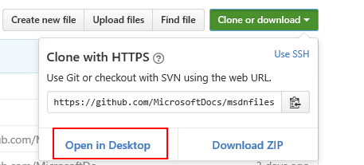
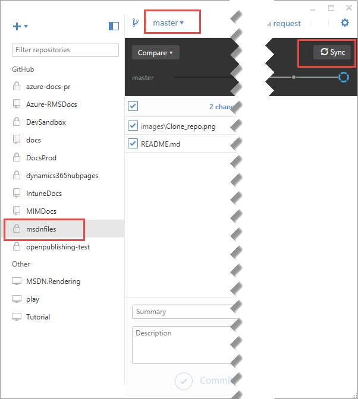
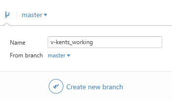
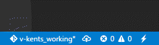
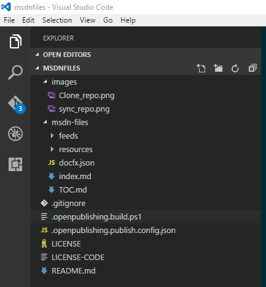
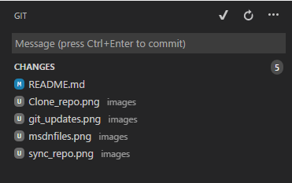
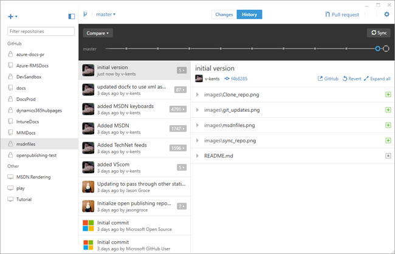
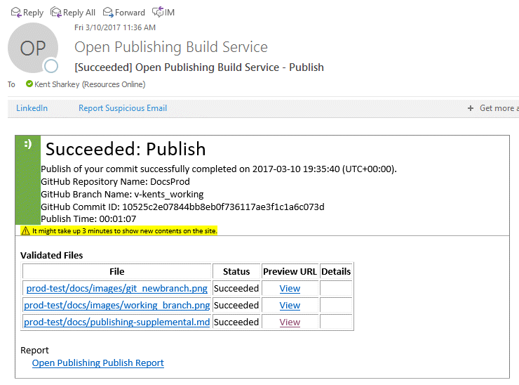
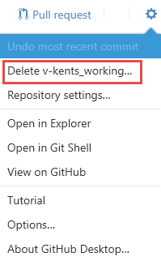

--- 
hide_bc: true
title: Self-publishing supplemental MSDN/TechNet content
---
# Self-publishing supplemental MSDN/TechNet content 

This document outlines the steps required to setup and publish supplemental files for MSDN/TechNet pages. 
This content includes JavaScript, CSS, and RSS files.

## Permissions

Before you can self-publish content, you must be a member of the Microsoft Docs organization on GitHub. 
See the [Microsoft GitHub organizations page](https://repos.opensource.microsoft.com/) for information on joining this organization.

In addition, you will need to be added as a contributor to the MSDN files repository. Email the APEX Production Leads
team to be added with the user id used to join the Microsoft Docs organization on GitHub.

## Installation of software

The recommended self-publishing process uses GitHub Desktop and Visual Studio Code for editing and publishing content.  

### Installing GitHub Desktop

The GitHub Desktop provides a more user-friendly way of working with GitHub repositories. 
Download and install the current version of [GitHub desktop](https://desktop.github.com/). 

> NOTE: The desktop client requires two-level authentication to first connect and create a SSH public key for your client. 
> See [Securing your account with two-factor authentication (2FA)](https://help.github.com/articles/securing-your-account-with-two-factor-authentication-2fa/) for details on setting up 2FA. 
> If you don’t have an authenticator application set up on your phone, you will need to log on to the [GitHub website](https://help.github.com/articles/configuring-two-factor-authentication-via-text-message/) and get a code sent to your phone to finish the authentication.

### Installing Visual Studio Code

Visual Studio Code is a simple, lightweight version of Visual Studio that makes working with GitHub easy. Install the latest
version of [Visual Studio Code](https://code.visualstudio.com/).

## Cloning the MSDN files repository

The first time before working with the content, you will need to clone the MSDN files repository to your local machine. 

> NOTE: You must have successfully authenticated the GitHub Desktop and have it open on your client before taking this step or the clone/download step will not work.

In a browser, access the [MDSN files repository](https://github.com/MicrosoftDocs/msdnfiles). Click the "Clone or Download" button
and select "Open in Desktop". 

. 

Select a location for the content. By default, this is C:\Users\\{UserID}\Documents\GitHub. 
Click OK to copy the contents of the repository to your local drive. Once it has completed, you can begin to edit and add files.

## Editing files

> Once content has been moved to the live branch, it is published automatically. 
> If you need to delay publishing your content, it is recommended that you create a new branch
> and do your editing in this branch. Use your alias for the branch name.

1. To ensure you have the latest version of the files in the repository, select the msdnfiles repository in the left sidebar of the GitHub Desktop client. Ensure that you have the master branch selected. Click the Sync button to synchronize your version of the repository with the server's.  

2. Create a new branch by clicking the Branch button in GitHub Desktop. Enter a name for the new branch (including your alias) and click Create new branch.  

3. Start Visual Studio Code. You should see the working branch in the lower right of the window.  
  
4. Select File, Open Folder and select the msdnfiles folder from your local computer. Typically, this will be C:\Users\\{UserID}\Documents\GitHub\msdnfiles.  

5. Edit files as needed. As you make changes, you will see the count of file changes update on the Git button in Visual Studio Code.  

6. When you are ready to stage your content, click the Git button on the View Bar in Visual Studio Code. This will show a list of the changed files. Enter a message describing the changes (for example, the work request number) and click the checkmark to commit the changes.  

7. Return to GitHub Desktop and click the History button in the top toolbar. You should see the commit message you just made, and the files changed in the list.  

8. Click the Publish button to synchronize your changes with the repository. This will also perform a build of the repository. You will receive an email when this build is complete (it should only take a few minutes.)  

9. The updated URLs will be listed in the Publishing Report linked in the email. They will take the form [https://review.docs.microsoft.com/en-us/msdn-files/feeds/msdn/en-us/magazine/rss.xml?branch={your branch name}](https://review.docs.microsoft.com/en-us/msdn-files/feeds/msdn/en-us/magazine/rss.xml?branch=master). These URLs can be used in PublishThis! and SMS for staging tests.

## Publishing files

When you are ready to publish your content, click the Create Pull Request button in the GitHub Desktop. This will notify Production Support admins, and they will perform the steps necessary to send the updates live. You will be notified when this is completed by email.

Once your changes have gone live, you can delete your branch. Click the gear button in the top right corner of GitHub Desktop, and select Delete {branch name}.  

Production Support admins publish the content by merging the content with the Master branch, and syncing with the server, then repeating with the Live branch. 

>Most users will not need these steps, but they're included for completeness.

1. Click the link provided in the email to view the Pull Request on the GitHub website. If all validations have passed, and everything else looks fine, click the Merge Changes button. This will commit the changes from the local branch into the master branch.
2. In GitHub Desktop, switch to the live branch. 
3. Click the Update from master button to move the changes from Master to Live.
4. Click the Sync button to move your changes to the server. This will also perform the steps needed to move the files to the live servers.