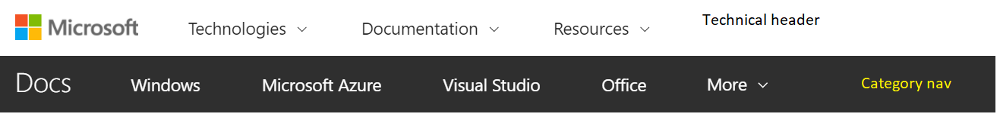
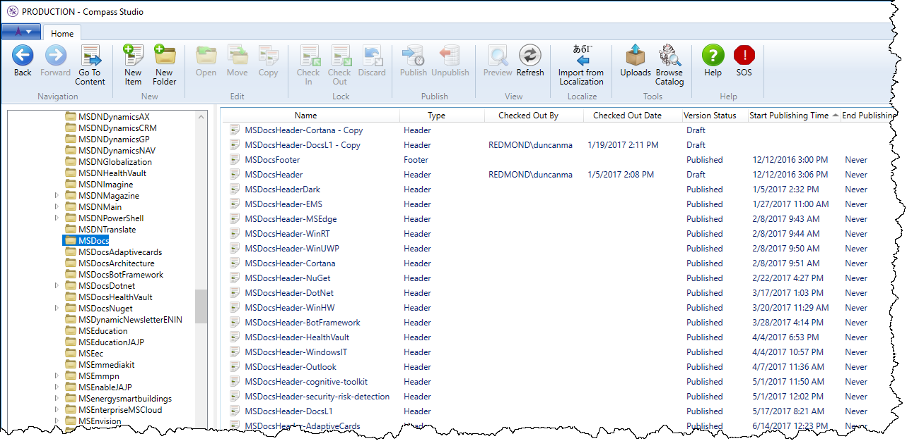
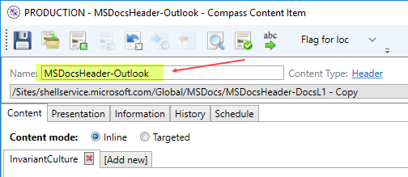

# Create a new partner UHF for a Docs site

The headers on Docs.microsoft.com are created through the Compass ([install](https://authoring.xbox.com)) tool. They are composed of two parts: the technical header and the category nav. The technical header is defined and configured by the UHF team, however the category nav is built out by the partner. The APEX team then creates a header in Compass that combines these.



> [!NOTE]
> Before creating the new header, you will need the ID of the category nav (aka category menu) created by the partner team. Rob Eisenberg usually provides this. Follow up with him if you don't have this. This should be fully qualified within the Compass tool, like ```/Sites/shellservice.microsoft.com/Global/DEV_Outlook/DEV_OutlookMenu```.

## Creating new header
1. Open Compass.
2. Verify that **PRODUCTION** is displayed in the **Connect to** dropdown list.
3. In the left pane, expand the nodes and navigate to ```/Sites/shellservice.microsoft.com/Global/MSDocs```.  
    
4. In the right pane, right-click on an existing UHF (like _MSDocsHeader-DocsL1_) and select **Copy**.
5. A copy of that UHF will be created with "_-Copy_" appended to the name.
6. Double-click the newly created UHF to open the new header.
7. In the **Name** field, provide a new appropriate title (such as MSDocsHeader-*Outlook*).  
    
8. Scroll down until you see the section called **Category Header Menu**.
9. To the right of the label, click the **Linked** radio button.
10. To the right of the **Linked** textbox, click the folder icon.
11. In the pop-up window (**Please choose a Content Type**...), use the left pane to navigate to and select the folder under _/Global/_ provided the partner (see Note above - in this example, it would be the _DEV\_Outlook_ folder).
12. In the right pane, select the name of the CategoryMenu type also provided by the partner (in this example, it would be the _DEV\_OutlookMenu_.).
13. Click **OK**.
14. Click the **Save** button in the upper left corner, then close the window.
15. In the right pane, select the new UHF you created.
16. Using the button bar on the Compass UI or the right-click context menu, select **Check In**.
17. Using the button bar on the Compass UI or the right-click context menu, select **Publish**.
18. A **Publish Confirmation** pop-up window will appear and will display if there are any warnings or validation issues.
19. Click **Publish**.
20. Click OK.

## Testing the header
Once published, the new header can take up to 24 hours to appear on the site, but within 30 minutes you can test it at the [UHF portal](https://uhf.azurewebsites.net/test).
* Go to the [UHF test portal](https://uhf.azurewebsites.net/test) and update the following items:
  * Partner ID = **MSDocs**
  * Header ID = *New header name* (should appear in the dropdown list)

The new header preview will show below the configuration settings.

## Adding new header to content
The partner needs to put the new header name in their config for their docset. Once you've tested the header at the portal, provide Rob Eisenberg (and the partner, if applicable) with the fully qualified name, such as ```/Sites/shellservice.microsoft.com/Global/MSDocs/MSDocsHeader-Outlook```.